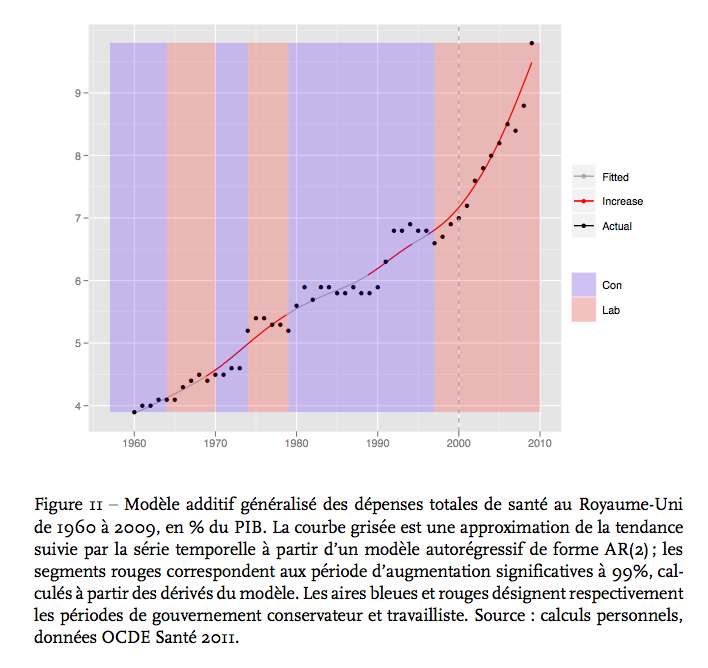

# Description

This repository holds the replication material for the analysis produced in "[Quand la biopolitique change les politiques : survie au cancer et réforme du système de santé en Angleterre](http://hal.archives-ouvertes.fr/hal-00675783)", presented at the [AFSP](http://www.afsp.msh-paris.fr/) Congress 2011 in Strasbourg, France.

# Sources

- Health care expenditure data from [OECD Health](http://www.oecd.org/health/healthdata) 2011.
- Cabinet government periods from [Number 10](http://www.number10.gov.uk/history-and-tour/past-prime-ministers/).

# Credits

The code uses functions written by [Robert H. Shumway](http://anson.ucdavis.edu/~shumway/) and [David S. Stoffer](http://www.stat.pitt.edu/stoffer/) for time series, and [Gavin Simpson](http://www.ucl.ac.uk/~ucfagls/) for additive models.

# Contact

Please feel free to send comments at [f.briatte@ed.ac.uk](f.briatte@ed.ac.uk).

> First release: March 2012.  
> Last revision: February 2013 (changes in ggplot2 syntax; graph code not optimized).
